# 🏗️ Архитектура AI Orchestrator

## Общая схема

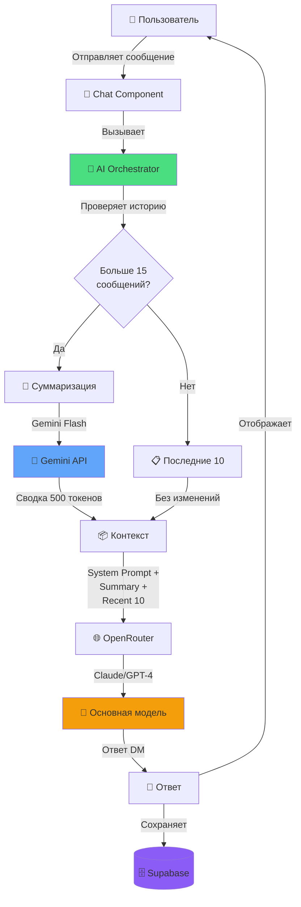

## Поток данных

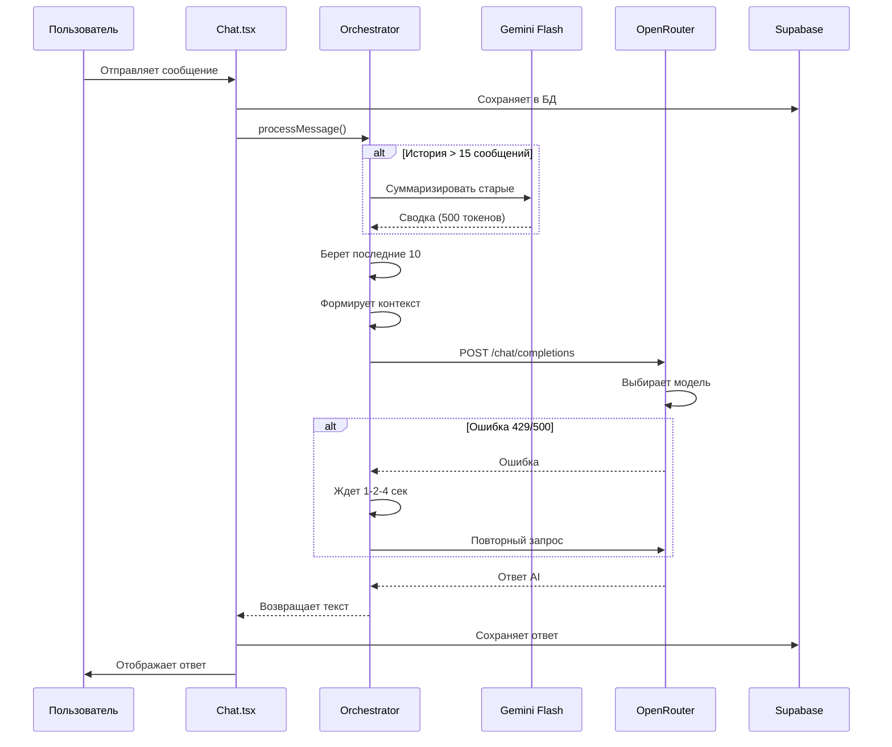

## Структура контекста

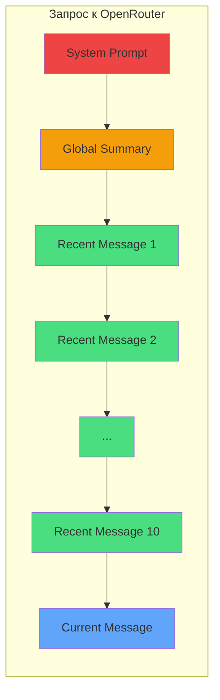

## Суммаризация

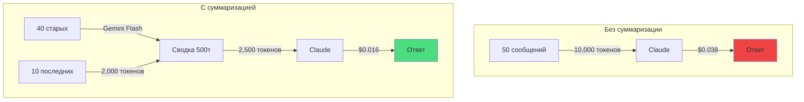

## Retry логика

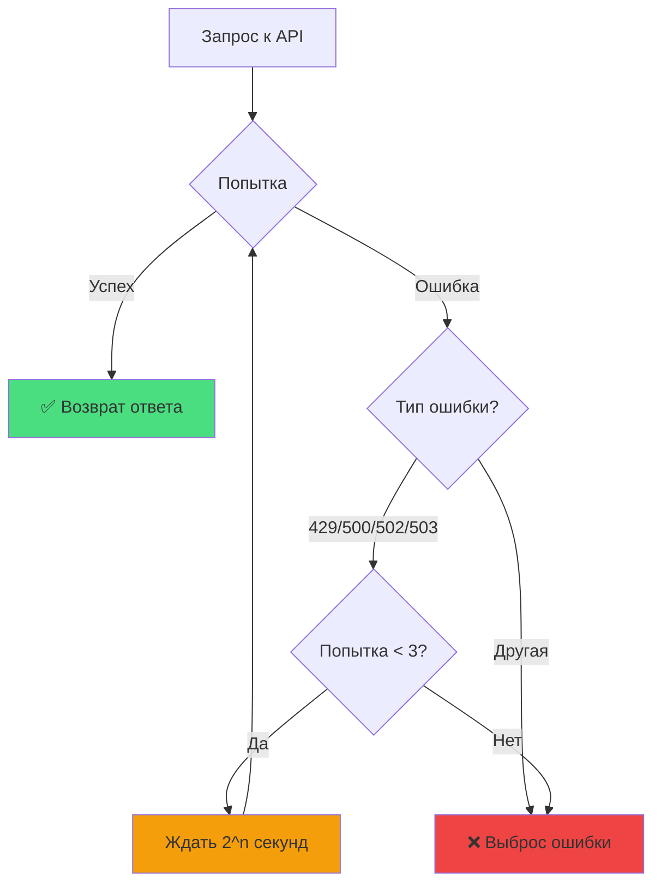

## Кэширование сводок

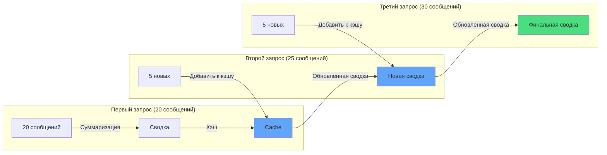

## Компоненты системы

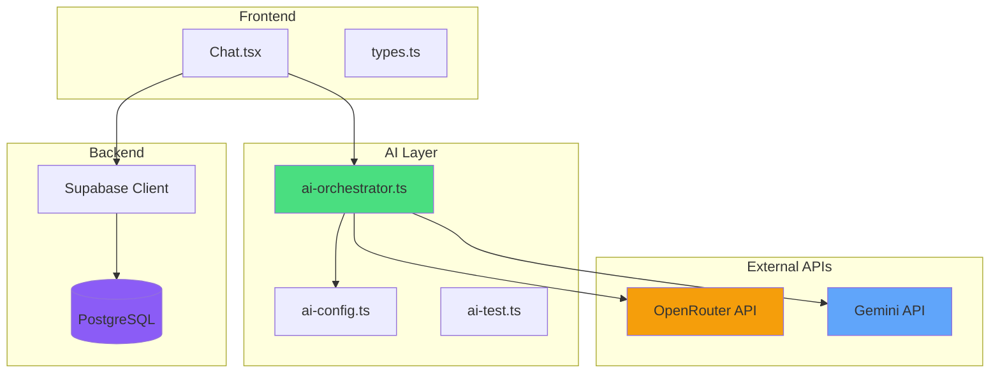

## Модели и их роли

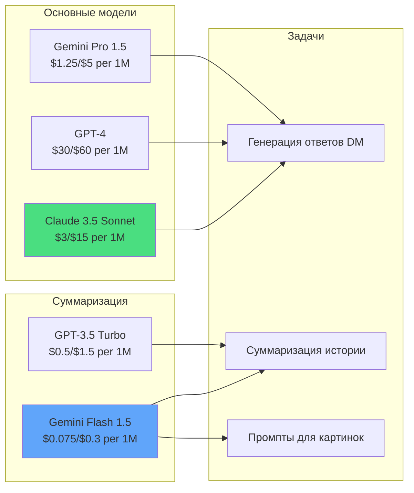

## Оптимизация токенов

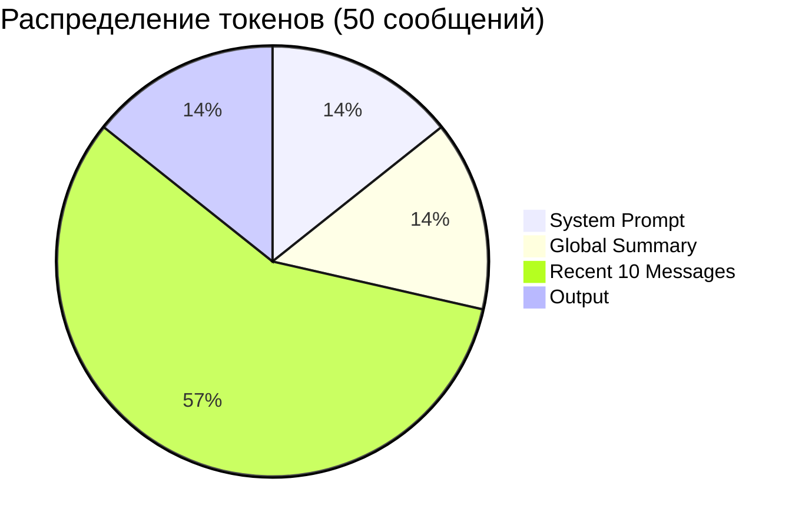

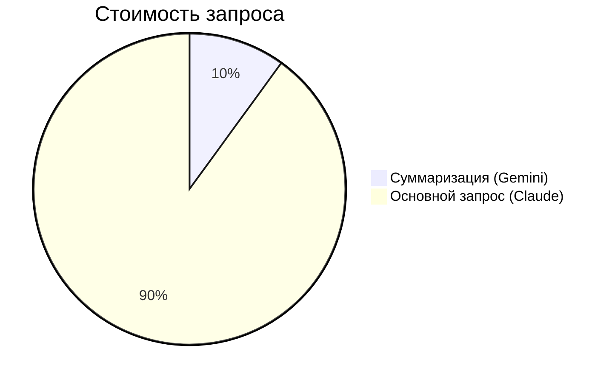

## Обработка ошибок

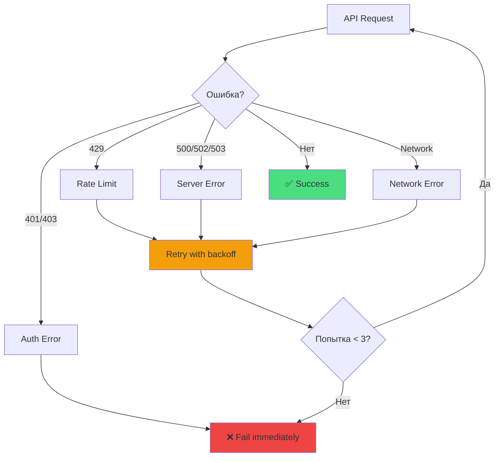

## Метрики производительности

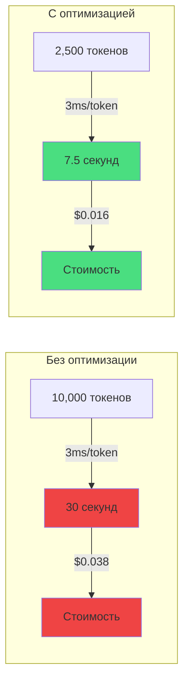

---

## Легенда

- 🟢 Зеленый - Оптимизированные компоненты
- 🔵 Синий - Внешние сервисы
- 🟠 Оранжевый - Основные модели
- 🟣 Фиолетовый - База данных
- 🔴 Красный - Неоптимизированные/ошибки
